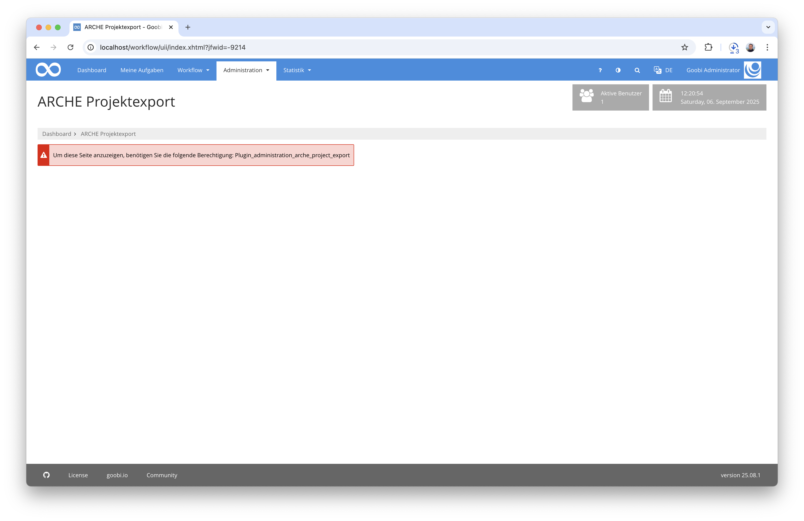
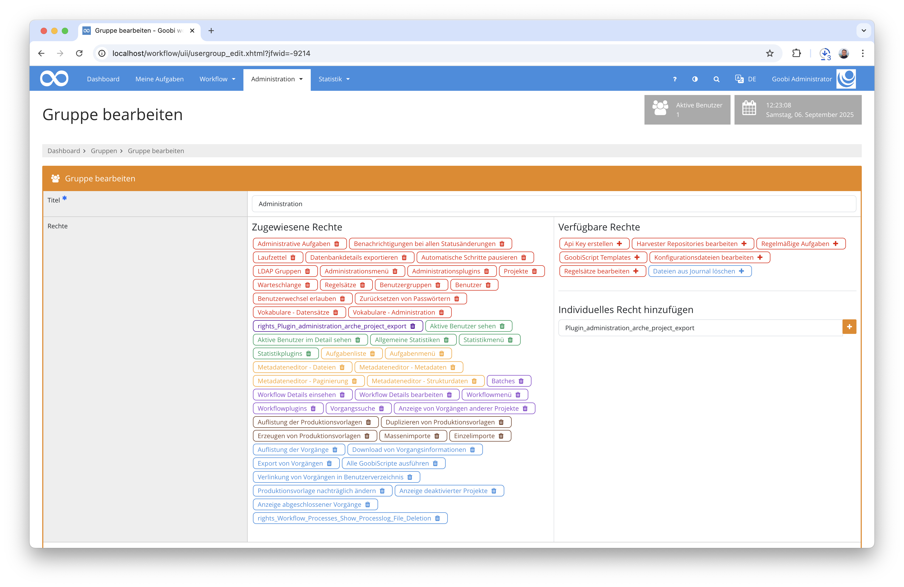
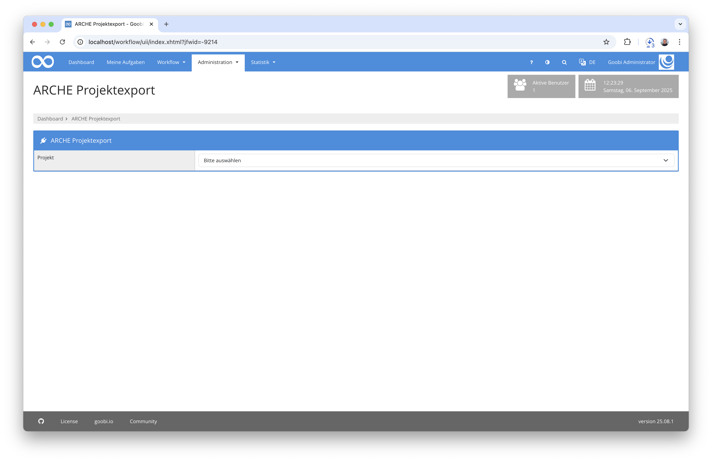
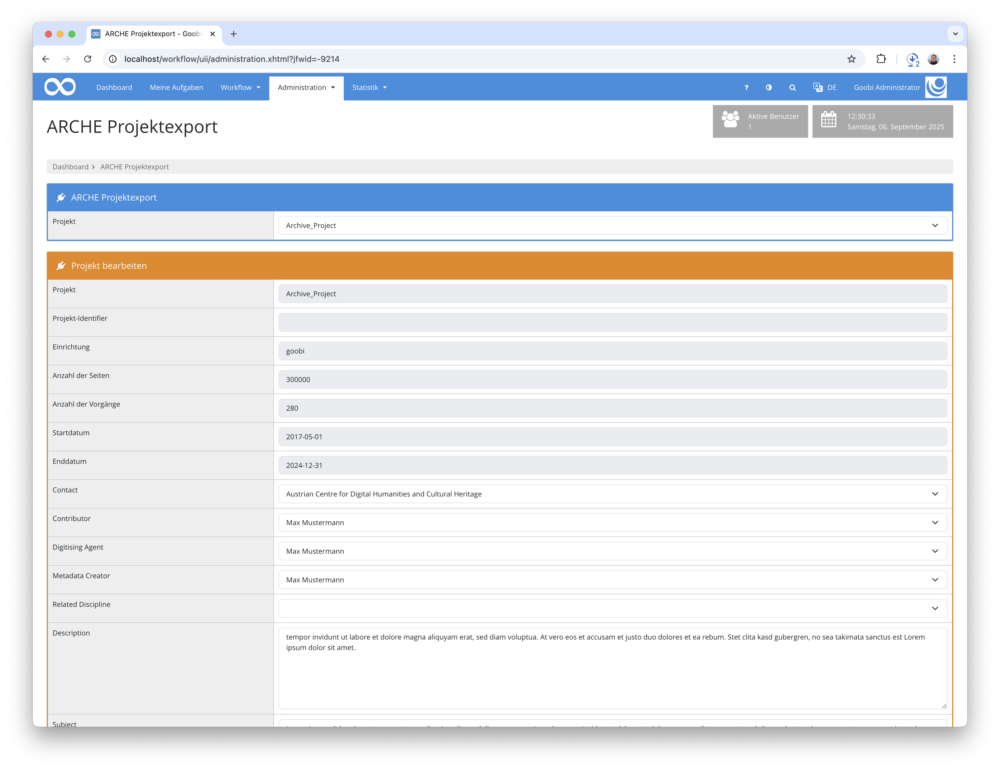
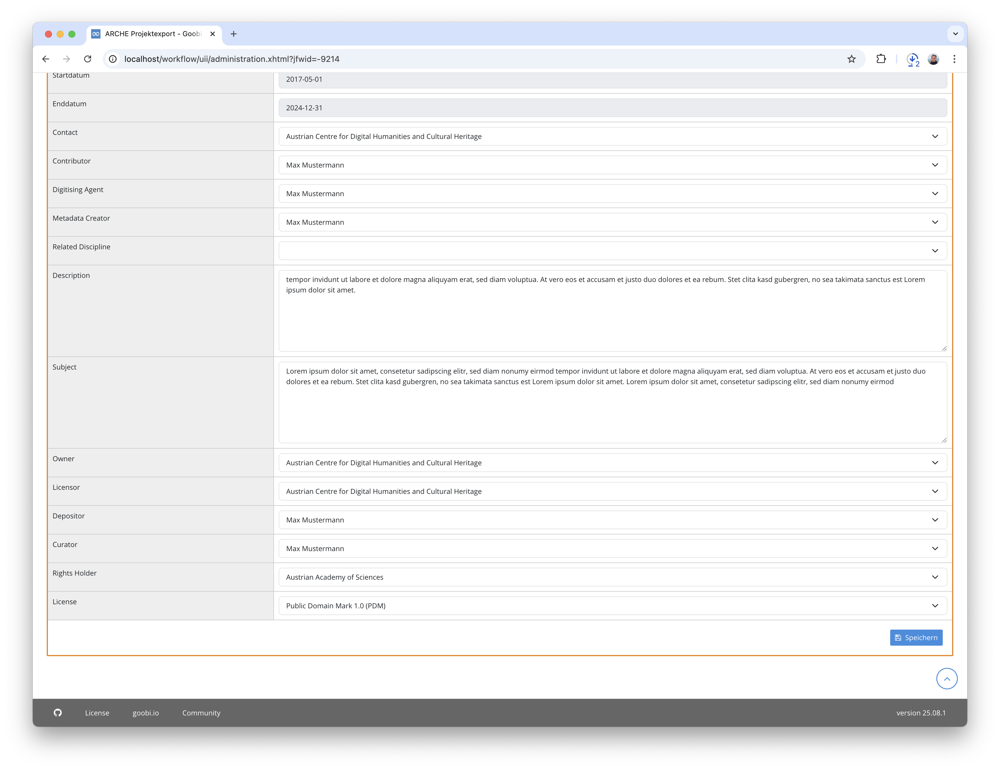

## Einführung
Dieses Administration-Plugin erlaubt es, Projekte als `TopCollection` im System ARCHE der Österreichischen Akademie der Wissenschaften anzulegen und zu aktualisieren.

## Installation
Um das Plugin nutzen zu können, müssen folgende Dateien installiert werden:

```bash
/opt/digiverso/goobi/plugins/administration/plugin-administration-arche_project_export-base.jar
/opt/digiverso/goobi/plugins/GUI/plugin-administration-arche_project_export-gui.jar
/opt/digiverso/goobi/config/plugin_intranda_administration_arche_project_export.xml
```

Für eine Nutzung dieses Plugins muss der Nutzer über die korrekte Rollenberechtigung verfügen.



Bitte weisen Sie daher der Gruppe die Rolle `Plugin_administration_arche_project_export` zu.




## Überblick und Funktionsweise
Wenn das Plugin korrekt installiert und konfiguriert wurde, ist es innerhalb des Menüpunkts `Administration` zu finden.



Hier kann als erstes das zu nutzende Projekt ausgewählt werden. Anschließend werden einige Felder angezeigt. Die oberen Felder kommen direkt aus den Projekteinstellungen und können hier nicht verändert werden. Alle weiteren Felder und deren Verhalten lassen sich über die Konfigurationsdatei definieren.



Wurden alle Pflichtfelder ausgefüllt, kann das Projekt exportiert werden. Alle konfigurierten Felder werden dabei als Projekteigenschaften gespeichert, anschließend  wird ein Turtle Document für die `TopCollection` erstellt. Da eine `TopCollection` nicht ohne weitere Resourcen existieren darf, wird außerdem eine Resource mit einem Platzhalterbild erstellt.

Die Datensätze werden dann als `POST Request` oder `PUT Request` an ARCHE geschickt, je nachdem, ob es sich um einen neuen Datensatz oder um ein Update eines bestehenden Datensatzes handelt.



Die URI zur `TopCollection` wird anschließend ebenfalls in Goobi als Projekteigenschaft gespeichert.

Für Debugging Zwecke können die Turtle Dokumente auch optional in ein konfigurierbares Serververzeichnis exportiert werden.

## Konfiguration
Die Konfiguration des Plugins erfolgt in der Datei `plugin_intranda_administration_arche_project_export.xml` wie hier aufgezeigt:

{{CONFIG_CONTENT}}

Die folgende Tabelle enthält eine Zusammenstellung der Parameter und ihrer Beschreibungen:

Parameter               | Erläuterung
------------------------|------------------------------------
`archeApiUrl`           | URL zur REST API der ARCHE Instanz
`archeUserName`         | Nutzername zur Authentifizierung an der API
`archePassword`         | Passwort zur Authentifizierung an der API
`archeUrlPropertyName`  | Name der Eigenschaft, in der die URI der TopCollection in Goobi gespeichert wird
`archeUrlPropertyName`  | Pfad zum Platzhalterbild
`viewerUrl`             | URL zum Goobi viewer. Wird in den Turtle-Datensätzen verwendet, um auf den Goobi viewer zu verlinken.
`exportFolder`          | Optionaler Order, in dem die generierten TTL Daten gespeichert werden können.
`property`              | Hier wird ein einzelnes Feld für die Anlegemaskte definiert. Das Attribut `name` enthält den Namen der Eigenschaft. Es kann mittels messages-Mechanismus in verschiedene Sprachen übersetzt werden. In `default` kann ein vorausgewählter Wert eingetragen werden. Das Attribut `type` definiert das Verhalten des Feldes, mögliche Werte sind `text` für ein einzeliges Feld, `textarea` für eine mehrzeilige Textbox, `list` für Auswahllisten, `boolean` für Checkboxen und `date` für Datumsangaben. Mittels `ttlType` wird festgelegt, ob es sich im TTL um ein Literal oder um eine Resource handelt. 
`select`                | Bei Listen muss mit Hilfe dieses Unterlements definiert werden, welche Daten zur Auswahl stehen. Das Attribut `label` enthält eine anzuzeigende Beschreibung und in `value` steht der Wert, der tatsächlich im TTL verwendet wird.

