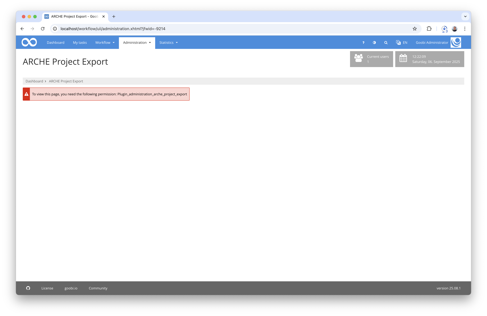
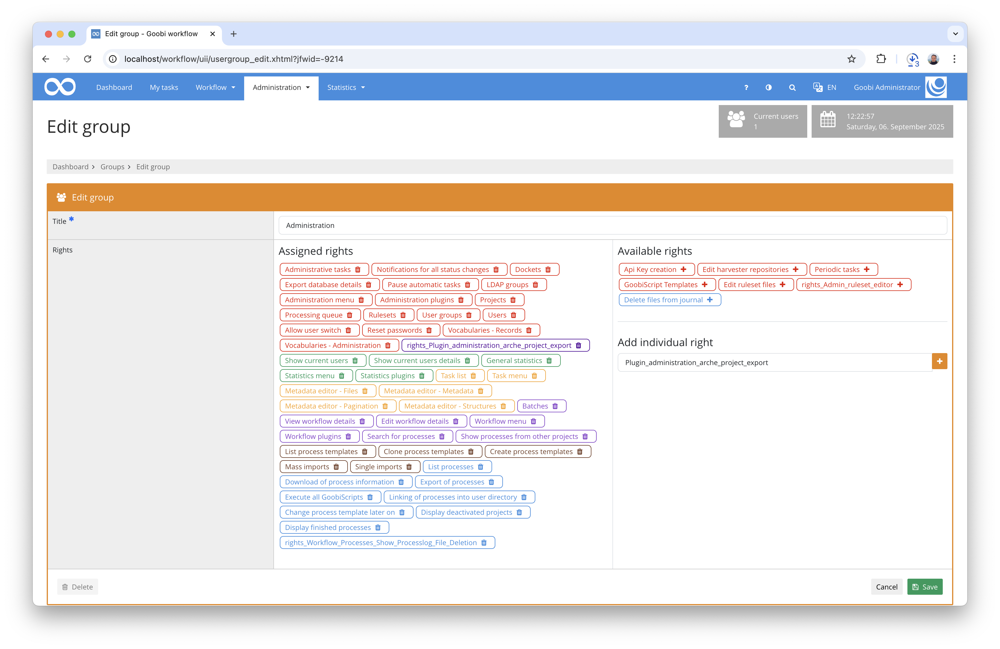
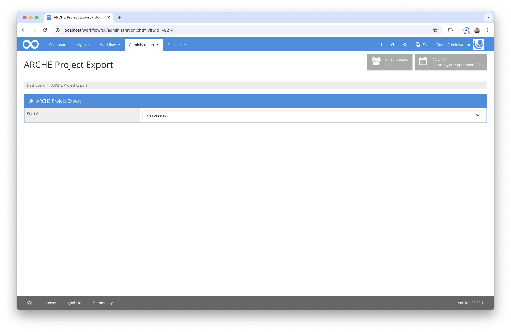
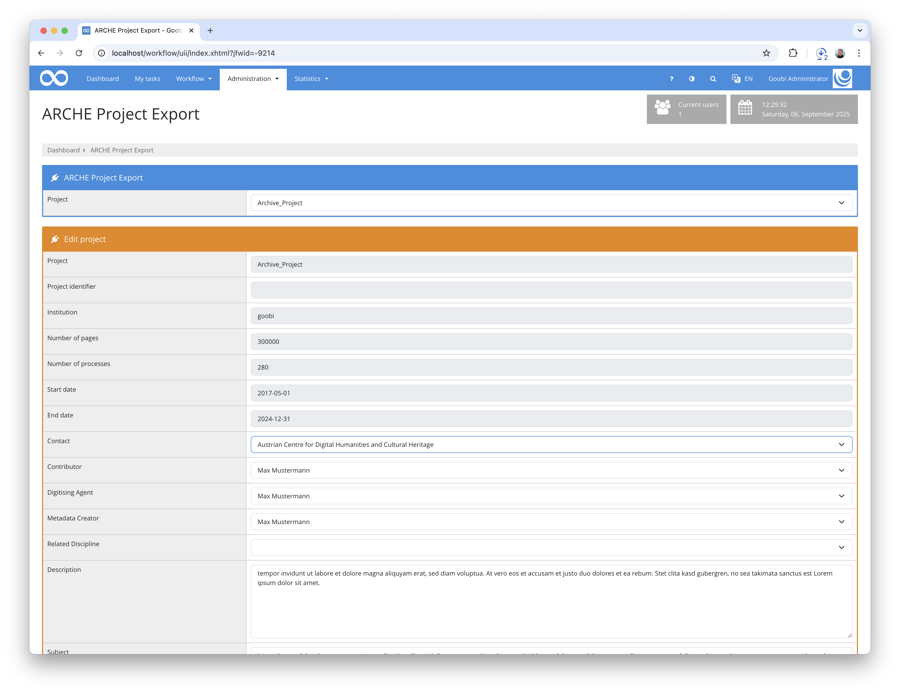
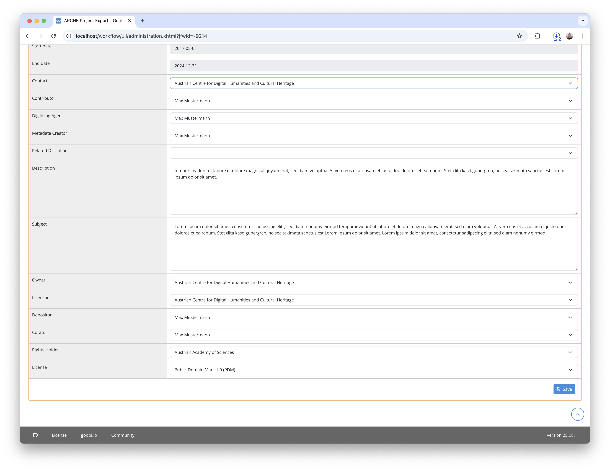

## Introduction
This administration plugin allows you to create and update projects as `TopCollection` in the ARCHE system of the Austrian Academy of Sciences.

## Installation
To use the plugin, the following files must be installed:

```bash
/opt/digiverso/goobi/plugins/administration/plugin-administration-arche_project_export-base.jar
/opt/digiverso/goobi/plugins/GUI/plugin-administration-arche_project_export-gui.jar
/opt/digiverso/goobi/config/plugin_intranda_administration_arche_project_export.xml
```

To use this plugin, the user must have the correct role authorisation.



Therefore, please assign the role `Plugin_administration_arche_project_export` to the group.




## Overview and functionality
Once the plugin has been correctly installed and configured, it can be found under the Administration menu item.



First, you can select the project to be used. Several fields will then be displayed. The upper fields come directly from the project settings and cannot be changed here. All other fields and their behaviour can be defined via the configuration file.



Once all mandatory fields have been filled in, the project can be exported. All configured fields are saved as project properties, and a Turtle Document is then created for the TopCollection. Since a TopCollection cannot exist without additional resources, a resource with a placeholder image is also created.

The data records are then sent to ARCHE as a `POST Request` or `PUT Request`, depending on whether it is a new data record or an update to an existing data record.



The URI for the `TopCollection` is then also saved in Goobi as a project property.

For debugging purposes, the Turtle documents can also be exported to a configurable server directory.

## Configuration
The plugin is configured in the file `plugin_intranda_administration_arche_project_export.xml` as shown here:

{{CONFIG_CONTENT}}

The following table contains a summary of the parameters and their descriptions:

Parameter               | Explanation
------------------------|------------------------------------
`archeApiUrl`           | URL to the REST API of the ARCHE instance
`archeUserName`         | Username for authentication at the API
`archePassword`         | Password for authentication at the API
`archeUrlPropertyName`  | Name of the property in which the URI of the TopCollection is stored in Goobi
`archeUrlPropertyName`  | Path to placeholder image
`viewerUrl`             | URL to the Goobi viewer. Used in Turtle records to link to the Goobi viewer.
`exportFolder`          | Optional order in which the generated TTL data can be stored.
`property`              | Here, a single field for the creation mask is defined. The attribute `name` contains the name of the property. It can be translated into different languages using the messages mechanism. A preselected value can be entered in `default`. The `type` attribute defines the behaviour of the field. Possible values are `text` for a single field, `textarea` for a multi-line text box, `list` for selection lists, `boolean` for checkboxes and `date` for date entries. `ttlType` is used to specify whether the TTL is a literal or a resource.
`select`                | For lists, this sub-element must be used to define which data is available for selection. The `label` attribute contains a description to be displayed, and `value` contains the value that is actually used in the TTL.
