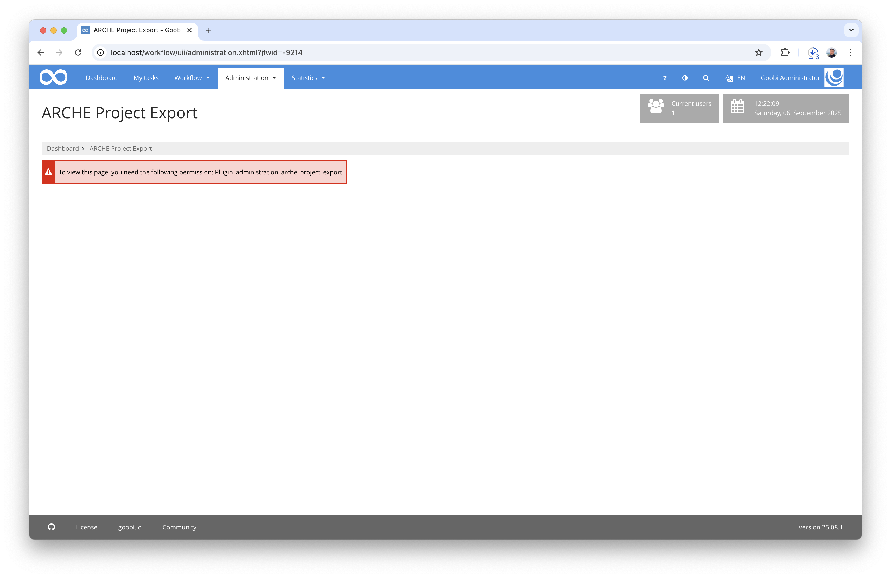
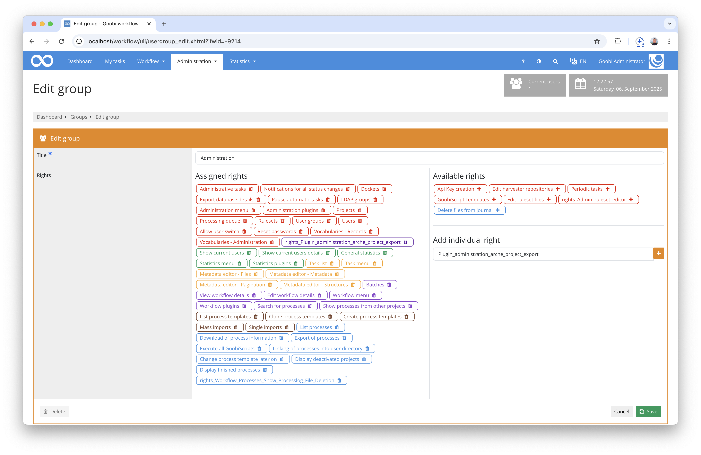
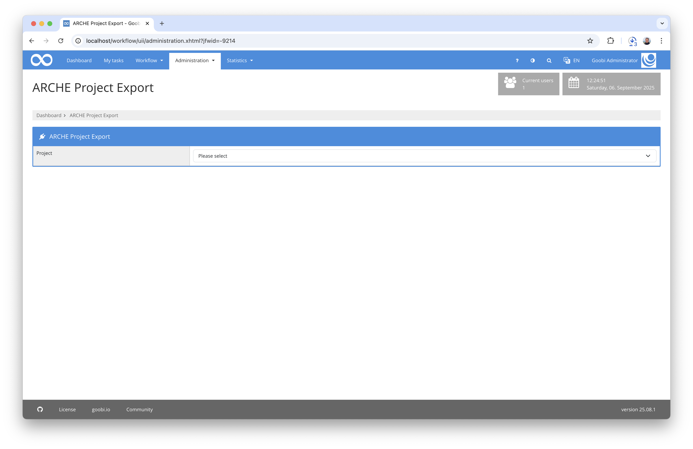
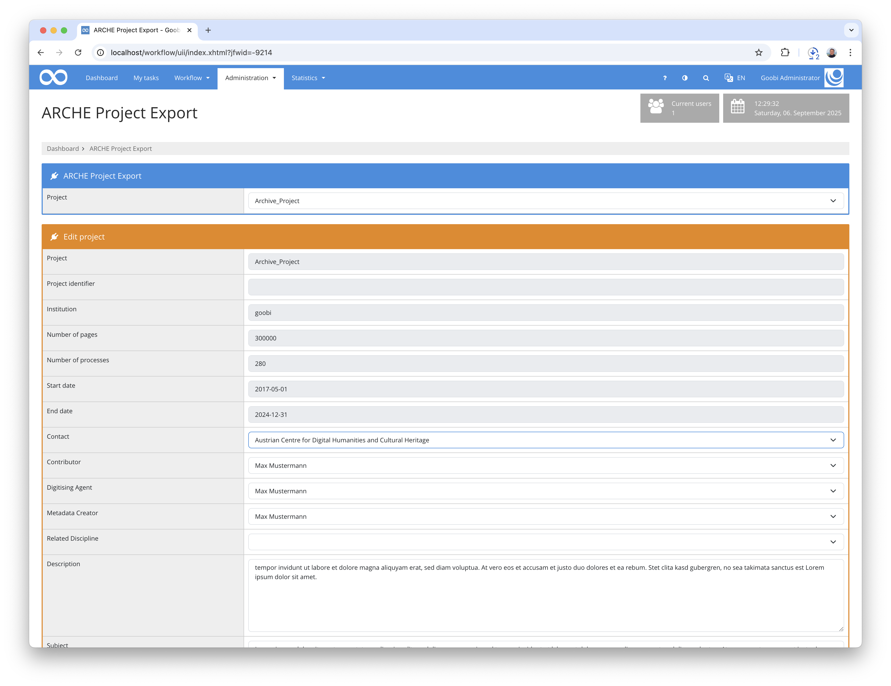
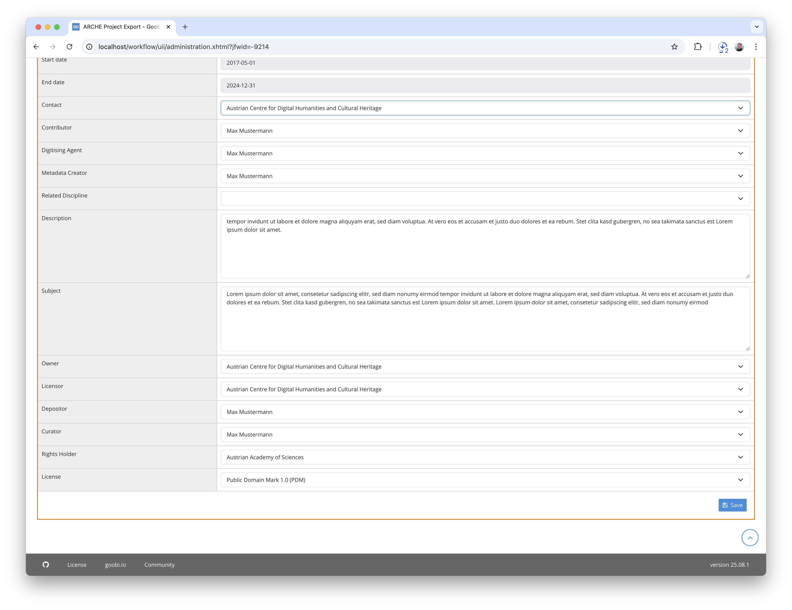

## Introduction
This administration plugin allows you to create and update projects as `TopCollection` in the ARCHE system of the Austrian Academy of Sciences.

## Installation
To use the plugin, the following files must be installed:

```bash
/opt/digiverso/goobi/plugins/administration/plugin-administration-arche_project_export-base.jar
/opt/digiverso/goobi/plugins/GUI/plugin-administration-arche_project_export-gui.jar
/opt/digiverso/goobi/config/plugin_intranda_administration_arche_project_export.xml
```

To use this plugin, the user must have the correct role authorisation.



Therefore, please assign the role `Plugin_administration_arche_project_export` to the group.




## Overview and functionality
Once the plugin has been correctly installed and configured, it can be found under the Administration menu item.



First, you can select the project to be used. Several fields will then be displayed. The upper fields come directly from the project settings and cannot be changed here. All other fields and their behaviour can be defined via the configuration file.

Below this is a drop-down menu for selecting the default language for the project’s metadata. The available language options are loaded from the `<languages>` configuration section. The selected value is saved as a project property and will be available as the default language for metadata fields.



Once all mandatory fields have been completed, the project can be saved. All fields are saved as project properties, after which a Turtle document is created for the `TopCollection`. 
Depending on the configuration, three export options are available:
* Save the file to a configured directory.
* Validate the TTL against the ARCHE Validation API (doorkeeper)
* Data ingestion into Arche

As a `TopCollection` cannot exist without additional resources, a resource with a placeholder image is created if the data ingestion option is selected.

The data records are then sent to ARCHE as a `POST Request` or `PUT Request`, depending on whether it is a new data record or an update to an existing data record.



The URI for the `TopCollection` is then also saved in Goobi as a project property.

For debugging purposes, the Turtle documents can also be exported to a configurable server directory.

## Configuration
The plugin is configured in the file `plugin_intranda_administration_arche_project_export.xml` as shown here:

{{CONFIG_CONTENT}}

The following table contains a summary of the parameters and their descriptions:

Parameter               | Explanation
------------------------|------------------------------------
`api/@enableValidation` | Enables or disables validation of the TTL file via the ARCHE API
`api/@enableIngest` | Enables or disables data ingestion in ARCHE
`archeApiUrl`           | URL to the REST API of the ARCHE instance
`archeUserName`         | Username for authentication at the API
`archePassword`         | Password for authentication at the API
`placeholderImage`      | Path to the placeholder image
`languagePropertyName`  | Name of the project property in which the selected default language is stored (default: `DefaultProjectLanguage`). This value is also read by the step plugin as `metadataDefaultLanguage`.
`exportFolder`          | Optional folder in which the generated TTL data can be stored.
`property`              | Here, a single field for the creation mask is defined. The attribute `name` contains the name of the property. It can be translated into different languages using the messages mechanism. A preselected value can be entered in `default`. The `type` attribute defines the behaviour of the field. Possible values are `text` for a single field, `textarea` for a multi-line text box, `list` for selection lists, `boolean` for checkboxes and `date` for date entries. `ttlType` is used to specify whether the TTL is a literal or a resource. The attribute `languageField="true"` additionally enables a language selection dropdown for that field.
`select`                | For lists, this sub-element must be used to define which data is available for selection. The `label` attribute contains a description to be displayed, and `value` contains the value that is actually used in the TTL.
`language`              | Defines a single language option for the project language dropdown and for language dropdowns on fields with `languageField="true"`. The `label` attribute contains the display name, `value` the iso-639 language code (e.g. `de`, `en`, `und`).
